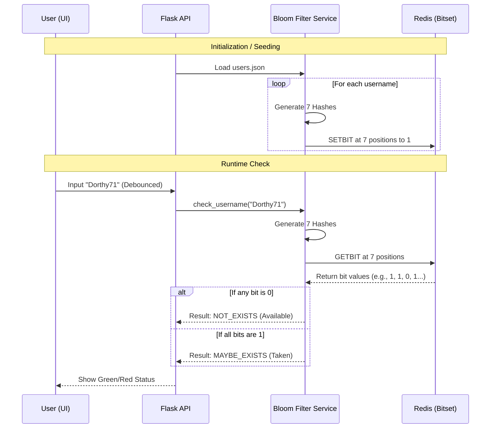

# End-to-End Bloom Filter Explanation

This document explains how the Bloom Filter implementation works in this project, from the mathematical concept to the Redis-backed implementation.

## 1. What is a Bloom Filter?
A Bloom Filter is a **probabilistic, space-efficient data structure** used to test whether an element is a member of a set.
- **True Negatives**: If it says "No", the item is **definitely NOT** in the set.
- **False Positives**: If it says "Yes", the item **might be** in the set.
- **Space Efficiency**: It uses a fixed-size bit array regardless of the number of items (though accuracy drops as items increase).

---

## 2. End-to-End Workflow



---

## 3. The Implementation Deep Dive

### A. The Hashing Mechanism
We use **7 hash functions** (controlled by `hash_count` in `.env`). Instead of 7 different algorithms, we use SHA-256 with a unique salt for each pass:
```python
# From api/services/bloom_filter.py
hash_val = int(hashlib.sha256(f"{i}:{value}".encode()).hexdigest(), 16)
position = hash_val % self.size
```
- `i`: The current index (0 to 6).
- `value`: The username string.
- `self.size`: The total number of bits (default 10,000,000).

### B. Redis Bitsets
Instead of storing strings (which consumes MBs or GBs), we use a single Redis key (`username_bloom_filter`) as a long binary string.
- **`SETBIT key offset 1`**: Flips a specific switch at a calculated position.
- **`GETBIT key offset`**: Reads the switch at that position.

### C. Why This is Fast
1. **O(k) Complexity**: Lookups depend only on the number of hashes ($k$), not the total number of items ($n$).
2. **Minimal Data Transfer**: Only individual bits are sent between Flask and Redis, not full objects.
3. **No Database Hits**: We don't query a traditional database (SQL/NoSQL) which involves disk I/O and complex indexing.

---

## 4. Scaling to 1 Crore (10 Million) Records
To handle 10 million records with a ~1% false positive rate:
- **Optimal Size ($m$)**: ~95 million bits (~12 MB of Redis RAM).
- **Optimal Hashes ($k$)**: ~7.

Our current default is **10 million bits**, which is very tiny (approx 1.2 MB) but will have a higher false positive rate as it fills up. You can tune these values in the `.env` file to balance memory vs accuracy.

---

## 5. False Positive Management
If the Bloom Filter says "Taken" but the user is actually new (False Positive), typical system designs handle this by:
1. First checking the Bloom Filter (fast path).
2. If "Taken", performing a final check against the actual database (slow path).
This implementation demonstrates the **Fast Path** that eliminates 99%+ of queries before they ever reach a heavy database.
